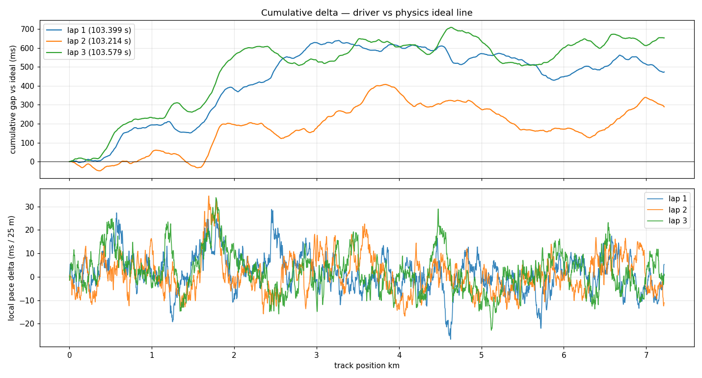
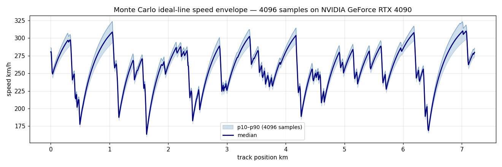

# SUZUKA // Telemetry & Predictive Line

**Dynamic Motorsport Telemetry & Predictive Line Visualizer** — portfolio project 1/2 (HAAS).

A physics-based ideal racing line computed on real Suzuka Circuit geometry, wrapped in a Monte
Carlo uncertainty ensemble (4096 samples on an RTX 4090), and compared against synthetic 100 Hz
driver telemetry — all rendered as a live **CesiumJS** experience with a delta heatmap ribbon
extruded above the track, timeline scrubbing, camera tracking, layer toggles, and a WebSocket
LIVE mode.

## At a glance

| Driver delta vs ideal line, lap by lap | Ideal-line speed profile with Monte Carlo p10–p90 band (4096 samples) |
|---|---|
|  |  |

The full experience — 3D track, extruded delta ribbon, timeline scrubbing, LIVE streaming — is in the interactive CesiumJS app (Live demo below).

## Live demo

**Static demo:** https://pgrinste.github.io/motorsport-telemetry/ — the `site/` bundle served from the repo's `gh-pages` branch (LIVE mode degrades gracefully without a WS server).

```bash
# Option A — local (Python 3.10+, venv with requirements.txt)
uvicorn app:app --host 127.0.0.1 --port 8321   # from server/
# → http://localhost:8321

# Option B — Docker (lightweight CPU container; GPU work is precomputed)
docker compose up -d                            # → http://localhost:8321

# Option C — fully static (no backend): serve the site/ folder from any host
# (GitHub Pages, S3, nginx). LIVE mode degrades gracefully when no WS server is present.
```

All local options bind to **127.0.0.1** by default (Docker's port map likewise stays on localhost), so nothing is exposed on your LAN unless you explicitly pass `--host 0.0.0.0`.

## Pipeline

```
OSM way 775428456 + real SRTM elevation (open-elevation.com)
        │  tools/fetch_track.py            → data/track_suzuka.json (1491 pts, corner map)
        ▼
src/physics.py   signed curvature → two-pass friction-circle solver (mu=1.05, brake 38 m/s²,
                 accel 11 m/s² + quadratic aero drag) → G-forces, throttle/brake, ERS battery
                 bookkeeping, lumped tire-thermal model      → outputs/ideal_line.json
        ▼
src/mc_ideal_line.py   GPU Monte Carlo: 4096 parameter samples × 3610 track points as a [N,n]
                 CUDA tensor (RTX 4090, ~355 MB VRAM, ~6 s) → data/mc_results.json (p10/p50/p90)
        ▼
src/telemetry.py   synthetic driver @100 Hz × 3 laps: per-corner skill errors (persistent),
                 apex clipping, AR(1) pace noise, warm-up→degradation lap scaling
                 → outputs/telemetry_driver.csv + outputs/delta.json
        ▼
src/czml_builder.py + src/build_bundle.py   → build/czml/telemetry.czml (driver + ideal ghost @5 Hz)
                                              + build/bundle.json (static data bundle)
        ▼
frontend/  CesiumJS: OSM imagery, custom vertex-colored delta ribbon geometry at elev+8 m,
           CZML playback (timeline scrubbing, ×1–60 speed), camera tracking, layer toggles,
           canvas speed-profile chart with MC band + live cursor, LIVE WebSocket mode
server/app.py  FastAPI: static frontend + /bundle.json + /czml/* + /ws/live (lap 2 @ native 100 Hz)
```

## Results (deterministic run)

| Quantity | Value |
|---|---|
| Ideal lap time | **102.93 s** (7.22 km OSM loop; official GP layout is 5.807 km — see note below) |
| Top speed / max G | 312 km/h · 1.04 g lateral · 3.88 g longitudinal |
| Monte Carlo lap mean [p10–p90] | 102.50 s [100.23 – 104.78] (4096 samples, RTX 4090) |
| Driver laps 1→3 | 103.40 / **103.21** / 103.58 s (warm-up fastest → degradation slowest) |
| ERS per lap | ~8 MJ harvested / ~11 MJ deployed (first-order bookkeeping, 4 MJ cap) |
| Tire thermal peak | 97 °C (lumped model, 35 °C ambient) |

## Model assumptions (honesty corner)

- **Geometry**: OSM traces the *outer edge* of the paved complex (~7.22 km), not the official
  5.807 km GP centerline. Corner anchors were curated against the official layout diagram,
  pit-lane position and the elevation profile (hairpin low point → Spoon summit 68 m → main
  straight 13 m). Elevation is real SRTM data.
- **Vehicle**: point-mass F1-class car (~800 kg), constant peak capability (no tire fade in the
  base profile), quadratic aero drag calibrated so top speed lands near 320 km/h.
- **ERS / tires**: first-order bookkeeping on the solved profile, not closed-loop.

## Regenerate everything

```bash
python src/physics.py && python src/mc_ideal_line.py && python src/telemetry.py \
  && python src/czml_builder.py && python src/build_bundle.py
# notebook (executed artifact committed): jupyter nbconvert --execute notebooks/ideal_line_analysis.ipynb --inplace
```

## Repo layout

| Path | Purpose |
|---|---|
| `data/` | track JSON + Monte Carlo results |
| `src/` | physics engine, MC ensemble, telemetry generator, CZML/bundle builders |
| `outputs/` | ideal line traces, 100 Hz driver CSV, delta arrays, figures |
| `frontend/` | CesiumJS app (index.html + js/app.js) |
| `server/` | FastAPI backend incl. `/ws/live` |
| `site/` | deployable static bundle (GitHub Pages-ready) |
| `notebooks/` | executed analysis notebook with embedded figures |
| `tools/` | track fetcher, Discord notifier, figure/notebook builders |

**Stack**: Python 3.10 · NumPy/SciPy · PyTorch CUDA (cu128) · FastAPI/WebSocket · CesiumJS 1.115 · Docker · OSM/SRTM data.
